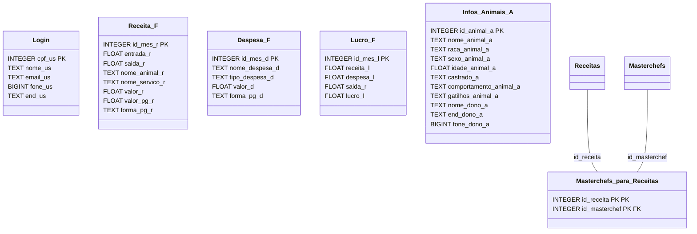

```mermaid
classDiagram
 class Login {
     INTEGER cpf_us PK
     TEXT nome_us
     TEXT email_us
     BIGINT fone_us
     TEXT end_us
 }

 class Receita_F {
     INTEGER id_mes_r PK
     FLOAT entrada_r
     FLOAT saida_r
     TEXT nome_animal_r
     TEXT nome_servico_r
     FLOAT valor_r
     FLOAT valor_pg_r
     TEXT forma_pg_r
 }

 class Despesa_F {
     INTEGER id_mes_d PK
     TEXT nome_despesa_d
     TEXT tipo_despesa_d
     FLOAT valor_d
     TEXT forma_pg_d
 }

 class Lucro_F {
     INTEGER id_mes_l PK
     FLOAT receita_l
     FLOAT despesa_l
     FLOAT saida_r
     FLOAT lucro_l
 }


 class Infos_Animais_A {
     INTEGER id_animal_a PK
     TEXT nome_animal_a
     TEXT raca_animal_a
     TEXT sexo_animal_a
     FLOAT idade_animal_a
     TEXT castrado_a
     TEXT comportamento_animal_a
     TEXT gatilhos_animal_a
     TEXT nome_dono_a
     TEXT end_dono_a
     BIGINT fone_dono_a
 }


 class Masterchefs_para_Receitas {
     INTEGER id_receita PK PK
     INTEGER id_masterchef PK FK
 }
 Receitas -- Masterchefs_para_Receitas : id_receita
 Masterchefs -- Masterchefs_para_Receitas : id_masterchef

```
