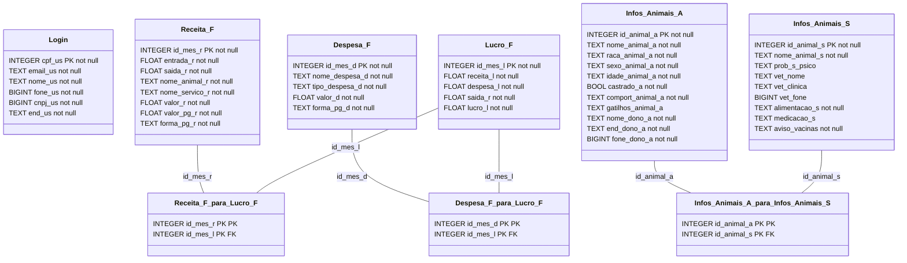

```mermaid
classDiagram
 class Login {
     INTEGER cpf_us PK not null
     TEXT email_us not null
     TEXT nome_us not null
     BIGINT fone_us not null
     BIGINT cnpj_us not null
     TEXT end_us not null
 }

 class Receita_F {
     INTEGER id_mes_r PK not null
     FLOAT entrada_r not null
     FLOAT saida_r not null
     TEXT nome_animal_r not null
     TEXT nome_servico_r not null
     FLOAT valor_r not null
     FLOAT valor_pg_r not null
     TEXT forma_pg_r not null
 }

 class Despesa_F {
     INTEGER id_mes_d PK not null
     TEXT nome_despesa_d not null
     TEXT tipo_despesa_d not null
     FLOAT valor_d not null
     TEXT forma_pg_d not null
 }

 class Lucro_F {
     INTEGER id_mes_l PK not null
     FLOAT receita_l not null
     FLOAT despesa_l not null
     FLOAT saida_r not null
     FLOAT lucro_l not null
 }

 class Infos_Animais_A {
     INTEGER id_animal_a PK not null
     TEXT nome_animal_a not null
     TEXT raca_animal_a not null
     TEXT sexo_animal_a not null
     TEXT idade_animal_a not null
     BOOL castrado_a not null
     TEXT comport_animal_a not null
     TEXT gatilhos_animal_a 
     TEXT nome_dono_a not null
     TEXT end_dono_a not null
     BIGINT fone_dono_a not null
 }
 
 class Infos_Animais_S {
    INTEGER id_animal_s PK not null
    TEXT nome_animal_s not null
    TEXT prob_s_psico
    TEXT vet_nome 
    TEXT vet_clinica 
    BIGINT vet_fone 
    TEXT alimentacao_s not null
    TEXT medicacao_s
    TEXT aviso_vacinas not null
 }

 class Receita_F_para_Lucro_F {
     INTEGER id_mes_r PK PK
     INTEGER id_mes_l PK FK
 }
 Receita_F -- Receita_F_para_Lucro_F : id_mes_r
 Lucro_F -- Receita_F_para_Lucro_F : id_mes_l
 
 class Despesa_F_para_Lucro_F {
     INTEGER id_mes_d PK PK
     INTEGER id_mes_l PK FK
 }
 Despesa_F -- Despesa_F_para_Lucro_F : id_mes_d
 Lucro_F -- Despesa_F_para_Lucro_F : id_mes_l
 
 class Infos_Animais_A_para_Infos_Animais_S {
     INTEGER id_animal_a PK PK
     INTEGER id_animal_s PK FK
 }
 Infos_Animais_A -- Infos_Animais_A_para_Infos_Animais_S : id_animal_a
 Infos_Animais_S -- Infos_Animais_A_para_Infos_Animais_S : id_animal_s

```
